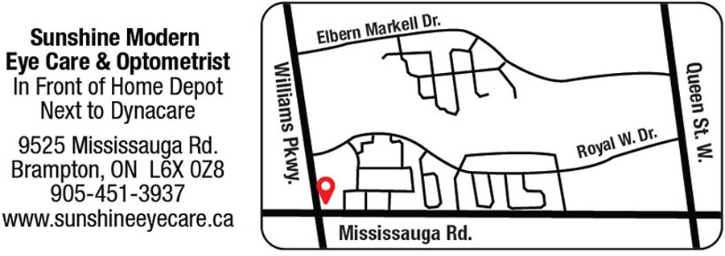

## Dr. Agatha Cheung  Optometrist

___

## Office Closure
Dear Patients,

It is with a heavy heart that I am writing to inform you I will no longer be practising in Brampton. Due to lease issues and family obligations, I have decided to focus my work in my Markham location. After working in Brampton for the past 13 years, I have gotten to know a lot of my patients and their families well. I will miss these interactions dearly. 

Rest assured, all your patient records will still be accessible. I have found a suitable home for them at Sunshine Modern Eye Care Optometric Clinic, where my associate who has been filling in for my maternity leave, Dr. Shayna Tailor, also works. Their staff will be happy to assist you during this transition. They offer direct billing for most insurance plans and are open 7 days a week. Please call them at **(905) 451- 3937** should you wish to book any appointments or inquire about when your next eye exam is due starting in September.

Please email bramptonoptometry@gmail.com before the end of this year should you have any questions or concerns. We will try to get back to you in a timely manner. The 125 Queen St. location will remain open until August 30th, 2022.

It has been a great pleasure working with you and I wish you all the best.

Sincerely,

Agatha Cheung, O.D. 

___

## Contact
bramptonoptometry@gmail.com  
(905)799-1724  
125 Queen Street East  
Unit 200  
Brampton, Ontario
